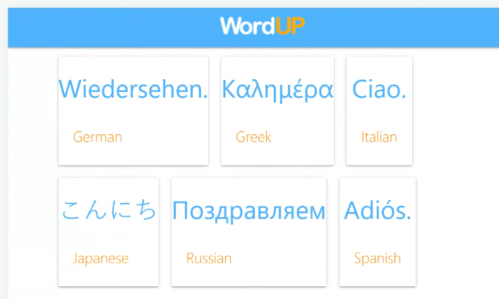
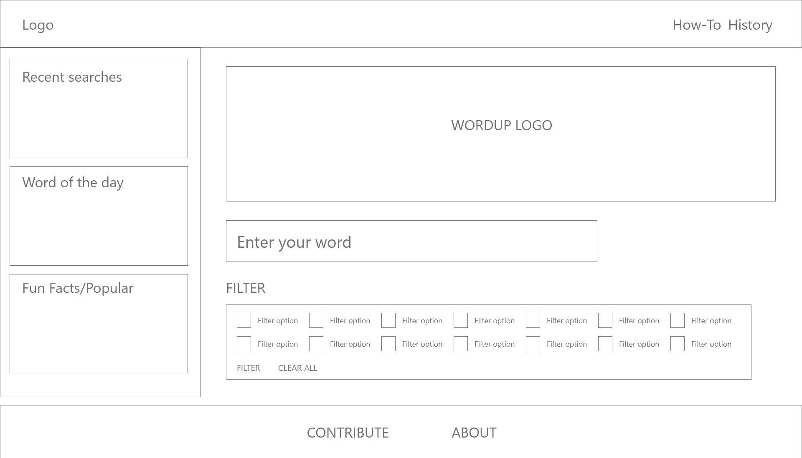

# WordUp Translation App

## Description

This repository is where we built the WordUp translation application to provide regional language translations for a given word or phrase. The application allows users to also view a random word generator, for copy and translation ideas, and also an About section and Contribute to the word library form.

## User Story
AS A creative professional, I WANT to be able to translate a word into multiple languages, SO THAT I can spark ideas for brand or product names, or assist in copy writing and campaigns.

## Acceptance Criteria
GIVEN I am using an web app to translate a word

WHEN I open the webpage,
THEN I am presented with a logo, a search bar, and a random word generator

WHEN I enter a new word in the search bar
THEN I have the option to filter the results - moved to future dev due to limitations of new API

WHEN the search results are returned,
THEN I can view translations of different regional languages

WHEN I view the translation results
THEN I am presented with the translation, the origin of the translation, and an option to show more information

WHEN I click on the Contribute button in the footer,
THEN I can access a contact form to send through my suggestions

WHEN I view my the About section
THEN I can read information about the product

WHEN I click the Random Word generator
THEN I am presented with a randomly generated word

WHEN I am using the web app,
THEN it meets all project criteria

## Usage

Open the application in your browser and enter a word into the search bar to begin. You will be given a list of translations for that word, the ten top languages as set by the selected API. You can also access the Random Word generator, as well as information about the development team, and a form to contribute to the word library.

Website URL: ("https://samantha-sokolis.github.io/team-project-1/")

## Directions for Future Development
- Sidebar function to include links to past searches 
- Drop down selection of languages
- Translate whole page - starting from a language other than English
- Additional info such as transliteration, definitions and examples
- Other API translations to include:
- Pop culture -  such as ‘Valley Girl’, ‘Yoda’ and ‘Dothraki’

## Credits

The following resources were referenced to ensure best practice and adherence to appropriate conventions.

CSS: 
https://materializecss.com/
https://tailwindcss.com/ (not used for final after conflicts with Materialize)

APIs and documentation:
lecto-translation.p.rapidapi.com - Lecto API on Rapid API
https://dashboard.lecto.ai/account/JAqhENqX4EuN8rL3JyWy/ - Lecto documentation
https://api-ninjas.com/api/randomword - randormword api documentation
https://www.hostinger.com/tutorials/err_name_not_resolved - API error
https://github.com/lecto-ai/docs/blob/main/examples/javascript/fetch_browser.js

Bug Fixes:
https://stackoverflow.com/questions/70236391/javascript-variable-in-the-body-of-a-fetch-request - Stack Overflow thread on adding a variable into a fetch body paramater

Social media placeholder links:
Instagram: https://www.instagram.com/corgistagrams/?hl=en
Facebook: https://www.facebook.com/groups/555989291132852/
Twitter: https://twitter.com/aboutcorgis?lang=en

Images and wireframing:
Adobe XD - wireframing
Adobe Illustrator - logos and images

Text animation in About section:
https://mattboldt.com/demos/typed-js/

## License

Licensed under the standard MIT license. Please refer to the license in the repo for more information.
